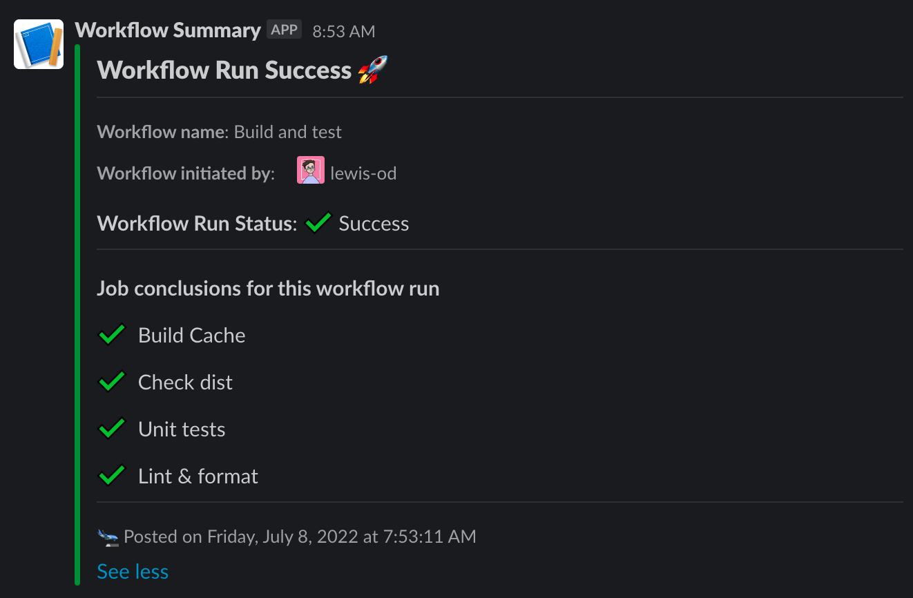

# Slack Workflow Summary
A Github Action to post a Slack message with a summary of the current workflow

## Inputs
The action accepts the following inputs

### `github-token`
**Required**: Token used to authenticate with the Github API in order to fetch workflow data.

### `slack-webhhok-url`
**Required**: A [Slack webhook URL] used to send the message.

[Slack webhook URL]: https://api.slack.com/messaging/webhooks

### `success-emoji`
The emoji used to indicate a successful job.

Default: `:white_check_mark:` ✅

### `skipped-emoji`
The emoji used to indicate a skipped job.

Default: `:heavy_minus_sign:` ➖

### `cancelled-emoji`
The emoji used to indicate a cancelled job.

Default: `:no_entry_sign:` :no_entry_sign:

### `failed-emoji`
The emoji used to indicate a failed job.

Default: `:x:` ❌

### `excluded-jobs`
Jobs to be excluded from the Slack message. Should be an array of Job titles.

Default: `''`

### `custom-blocks`
Custom message blocks to include in the message, after the job summary. Should be an array of
[Slack blocks] in JSON format, e.g.:
```json
[
  {
    "type": "section",
    "text": {
      "type": "mrkdwn",
      "text": "**Custom Block**: This is a custom block"
    }
  }
]
```


[Slack blocks]: https://api.slack.com/reference/block-kit/blocks

Default: `''`

## Example usage
```yaml
slack_summary:
  name: 'Post summary to Slack'
  runs-on: ubuntu-latest
  if: always() # Always post a summary, even if jobs have failed
  needs: # Only completed jobs are included in the summary, so this should run at the end of your workflow
    - test
    - lint_and_format
    - check_dist
  steps:
    - name: 'Post summary'
      uses: crederauk/slack-workflow-summary@v1
      with:
        github-token: ${{ secrets.GITHUB_TOKEN }}
        slack-webhook-url: ${{ secrets.SLACK_WEBHOOK_URL }}
        success-emoji: ':heavy-check-mark:'
        skipped-emoji: ':heavy-minus-sign:'
        failed-emoji: ':heavy-cross-mark:'
```

Including this in the [test workflow] in this repo produces the following message:



[test workflow]: .github/workflows/test.yml
